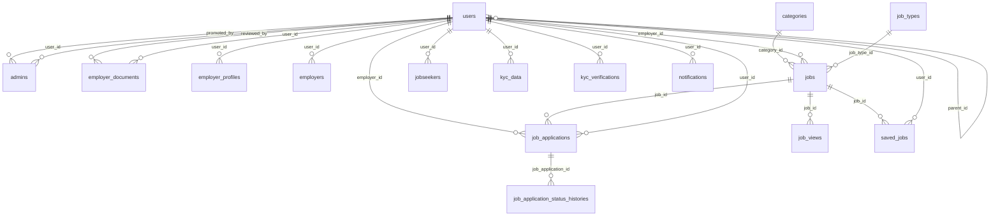

# Job Portal Database Documentation

Generated on: 2025-08-11 13:56:07

## Database Overview

This database powers a comprehensive job portal system with the following main components:

- **User Management**: Multi-role user system (Admin, Employer, Job Seeker)
- **Job Management**: Job postings, applications, and categorization
- **Profile Management**: Detailed profiles for employers and job seekers
- **Verification System**: KYC verification for users
- **Notification System**: Real-time notifications and alerts
- **Analytics**: Job views and application tracking

## Database Statistics

- **Total Tables**: 24
- **Total Records**: 286

## Tables Overview

| Table | Records | Purpose |
|-------|---------|----------|
| `admins` | 1 | Administrative user profiles with permissions and access control settings |
| `categories` | 20 | Job categories/industries for organizing and filtering job postings |
| `company_sizes` | 6 | Purpose not documented - requires manual review |
| `employer_documents` | 6 | Business documents and certificates uploaded by employers for verification |
| `employer_profiles` | 3 | Legacy employer profile table, may contain additional employer information |
| `employers` | 2 | Extended profile information for users with employer role, company details and verification |
| `industries` | 10 | Purpose not documented - requires manual review |
| `job_application_status_histories` | 3 | Audit trail of job application status changes over time |
| `job_applications` | 2 | Applications submitted by job seekers for specific job postings, tracking application status |
| `job_categories` | 10 | Purpose not documented - requires manual review |
| `job_skills` | 17 | Purpose not documented - requires manual review |
| `job_types` | 8 | Employment types (full-time, part-time, contract, etc.) for job classification |
| `job_user` | 0 | Many-to-many pivot table for saved jobs relationship between users and jobs |
| `job_views` | 99 | Tracking table for job post views and analytics, helps with recommendations |
| `jobs` | 2 | Job postings created by employers with all job details, requirements, and status information |
| `jobseekers` | 5 | Comprehensive profile information for job seekers including skills, experience, and preferences |
| `kyc_data` | 2 | Stored KYC verification data and documents for verified users |
| `kyc_verifications` | 0 | Know Your Customer verification sessions and status for user identity verification |
| `locations` | 10 | Purpose not documented - requires manual review |
| `migrations` | 37 | Laravel migration history table tracking database schema changes |
| `notifications` | 31 | System notifications and alerts for users about various events and updates |
| `personal_access_tokens` | 0 | API tokens for authenticated access to the application |
| `saved_jobs` | 1 | User saved/bookmarked jobs for later viewing or application |
| `users` | 11 | Core user accounts table storing authentication and basic profile information for all user types (admin, employer, jobseeker) |

## Detailed Table Documentation

### `admins` Table

**Purpose**: Administrative user profiles with permissions and access control settings

**Records**: 1

#### Columns

| Column | Type | Null | Key | Default | Description |
|--------|------|------|-----|---------|-------------|
| `id` | bigint(20) unsigned | ❌ | PRI | - | Primary key - unique identifier |
| `user_id` | bigint(20) unsigned | ❌ | MUL | - | Foreign key reference to users table |
| `admin_level` | varchar(255) | ❌ | MUL | admin | Administrative level or hierarchy |
| `department` | varchar(255) | ✅ | MUL | - | Administrative department |
| `position` | varchar(255) | ✅ | - | - | Administrative position |
| `responsibilities` | text | ✅ | - | - | List of admin responsibilities |
| `permissions` | longtext | ✅ | - | - | JSON array of detailed permissions |
| `accessible_modules` | longtext | ✅ | - | - | JSON array of accessible system modules |
| `can_manage_users` | tinyint(1) | ❌ | - | - | Permission to manage users |
| `can_manage_jobs` | tinyint(1) | ❌ | - | - | Permission to manage jobs |
| `can_manage_employers` | tinyint(1) | ❌ | - | - | Permission to manage employers |
| `can_view_analytics` | tinyint(1) | ❌ | - | - | Permission to view analytics |
| `can_manage_settings` | tinyint(1) | ❌ | - | - | Permission to manage system settings |
| `can_manage_admins` | tinyint(1) | ❌ | - | - | Permission to manage other admins |
| `status` | enum('active','inactive','suspended') | ❌ | - | active | Current status of the record |
| `last_login_at` | timestamp | ✅ | - | - | Last login timestamp |
| `last_login_ip` | varchar(255) | ✅ | - | - | IP address of last login |
| `login_history` | longtext | ✅ | - | - | JSON array of login history |
| `actions_performed` | int(11) | ❌ | - | - | Count of administrative actions performed |
| `promoted_at` | timestamp | ✅ | - | - | Timestamp when user was promoted to admin |
| `promoted_by` | bigint(20) unsigned | ✅ | MUL | - | ID of admin who promoted this user |
| `force_password_change` | tinyint(1) | ❌ | - | - | Boolean flag to force password change |
| `password_changed_at` | timestamp | ✅ | - | - | Timestamp of last password change |
| `created_at` | timestamp | ✅ | - | - | Timestamp when record was created |
| `updated_at` | timestamp | ✅ | - | - | Timestamp when record was last updated |

#### Foreign Keys

| Column | References | Description |
|--------|------------|-------------|
| `promoted_by` | `users`.`id` | Links to users table |
| `user_id` | `users`.`id` | Links to users table |

#### Indexes

| Name | Type | Unique | Columns |
|------|------|--------|----------|
| `PRIMARY` | BTREE | ✅ | id |
| `admins_user_id_foreign` | BTREE | ❌ | user_id |
| `admins_promoted_by_foreign` | BTREE | ❌ | promoted_by |
| `admins_admin_level_status_index` | BTREE | ❌ | admin_level, status |
| `admins_department_index` | BTREE | ❌ | department |

---

### `categories` Table

**Purpose**: Job categories/industries for organizing and filtering job postings

**Records**: 20

#### Columns

| Column | Type | Null | Key | Default | Description |
|--------|------|------|-----|---------|-------------|
| `id` | bigint(20) unsigned | ❌ | PRI | - | Primary key - unique identifier |
| `name` | varchar(255) | ❌ | - | - | Name or title field |
| `slug` | varchar(255) | ❌ | UNI | - | SEO-friendly URL identifier for the category |
| `status` | tinyint(1) | ❌ | - | 1 | Current status of the record |
| `icon` | varchar(255) | ✅ | - | - | Icon class name for displaying category icon |
| `created_at` | timestamp | ✅ | - | - | Timestamp when record was created |
| `updated_at` | timestamp | ✅ | - | - | Timestamp when record was last updated |
| `deleted_at` | timestamp | ✅ | - | - | No description available |

#### Referenced By

| Table | Column | Description |
|-------|--------|-------------|
| `jobs` | `category_id` | jobs references this table |

#### Indexes

| Name | Type | Unique | Columns |
|------|------|--------|----------|
| `PRIMARY` | BTREE | ✅ | id |
| `categories_slug_unique` | BTREE | ✅ | slug |

---

### `company_sizes` Table

**Purpose**: Purpose not documented - requires manual review

**Records**: 6

#### Columns

| Column | Type | Null | Key | Default | Description |
|--------|------|------|-----|---------|-------------|
| `id` | bigint(20) unsigned | ❌ | PRI | - | Primary key - unique identifier |
| `range` | varchar(255) | ❌ | - | - | No description available |
| `min_employees` | int(11) | ❌ | - | - | No description available |
| `max_employees` | int(11) | ✅ | - | - | No description available |
| `label` | varchar(255) | ❌ | - | - | No description available |
| `sort_order` | int(11) | ❌ | MUL | - | No description available |
| `created_at` | timestamp | ✅ | - | - | Timestamp when record was created |
| `updated_at` | timestamp | ✅ | - | - | Timestamp when record was last updated |

#### Indexes

| Name | Type | Unique | Columns |
|------|------|--------|----------|
| `PRIMARY` | BTREE | ✅ | id |
| `company_sizes_sort_order_index` | BTREE | ❌ | sort_order |

---

### `employer_documents` Table

**Purpose**: Business documents and certificates uploaded by employers for verification

**Records**: 6

#### Columns

| Column | Type | Null | Key | Default | Description |
|--------|------|------|-----|---------|-------------|
| `id` | bigint(20) unsigned | ❌ | PRI | - | Primary key - unique identifier |
| `user_id` | bigint(20) unsigned | ❌ | MUL | - | Foreign key reference to users table |
| `document_type` | varchar(255) | ❌ | MUL | - | No description available |
| `document_name` | varchar(255) | ❌ | - | - | No description available |
| `file_path` | varchar(255) | ❌ | - | - | No description available |
| `file_name` | varchar(255) | ❌ | - | - | No description available |
| `file_size` | varchar(255) | ❌ | - | - | No description available |
| `mime_type` | varchar(255) | ❌ | - | - | No description available |
| `status` | enum('pending','approved','rejected') | ❌ | - | pending | Current status of the record |
| `admin_notes` | text | ✅ | - | - | No description available |
| `submitted_at` | timestamp | ❌ | - | current_timestamp() | No description available |
| `reviewed_at` | timestamp | ✅ | - | - | No description available |
| `reviewed_by` | bigint(20) unsigned | ✅ | MUL | - | No description available |
| `created_at` | timestamp | ✅ | - | - | Timestamp when record was created |
| `updated_at` | timestamp | ✅ | - | - | Timestamp when record was last updated |

#### Foreign Keys

| Column | References | Description |
|--------|------------|-------------|
| `reviewed_by` | `users`.`id` | Links to users table |
| `user_id` | `users`.`id` | Links to users table |

#### Indexes

| Name | Type | Unique | Columns |
|------|------|--------|----------|
| `PRIMARY` | BTREE | ✅ | id |
| `employer_documents_reviewed_by_foreign` | BTREE | ❌ | reviewed_by |
| `employer_documents_user_id_status_index` | BTREE | ❌ | user_id, status |
| `employer_documents_document_type_index` | BTREE | ❌ | document_type |

---

### `employer_profiles` Table

**Purpose**: Legacy employer profile table, may contain additional employer information

**Records**: 3

#### Columns

| Column | Type | Null | Key | Default | Description |
|--------|------|------|-----|---------|-------------|
| `id` | bigint(20) unsigned | ❌ | PRI | - | Primary key - unique identifier |
| `user_id` | bigint(20) unsigned | ❌ | MUL | - | Foreign key reference to users table |
| `company_name` | varchar(255) | ✅ | - | - | No description available |
| `company_description` | text | ✅ | - | - | No description available |
| `industry` | varchar(255) | ✅ | - | - | No description available |
| `company_size` | varchar(255) | ✅ | - | - | No description available |
| `website` | varchar(255) | ✅ | - | - | No description available |
| `company_logo` | varchar(255) | ✅ | - | - | No description available |
| `location` | varchar(255) | ✅ | - | - | Job location (city, state, country) |
| `social_links` | longtext | ✅ | - | - | No description available |
| `status` | varchar(255) | ❌ | - | draft | Current status of the record |
| `company_culture` | longtext | ✅ | - | - | No description available |
| `benefits_offered` | longtext | ✅ | - | - | No description available |
| `total_jobs_posted` | int(11) | ❌ | - | - | No description available |
| `active_jobs` | int(11) | ❌ | - | - | No description available |
| `total_applications_received` | int(11) | ❌ | - | - | No description available |
| `profile_views` | int(11) | ❌ | - | - | No description available |
| `is_verified` | tinyint(1) | ❌ | - | - | No description available |
| `is_featured` | tinyint(1) | ❌ | - | - | Boolean flag for featured job posts |
| `created_at` | timestamp | ✅ | - | - | Timestamp when record was created |
| `updated_at` | timestamp | ✅ | - | - | Timestamp when record was last updated |
| `deleted_at` | timestamp | ✅ | - | - | No description available |
| `founded_year` | year(4) | ✅ | - | - | No description available |
| `headquarters` | varchar(255) | ✅ | - | - | No description available |
| `specialties` | longtext | ✅ | - | - | No description available |
| `company_video` | varchar(255) | ✅ | - | - | No description available |
| `gallery_images` | longtext | ✅ | - | - | No description available |
| `hiring_process` | longtext | ✅ | - | - | No description available |
| `contact_email` | varchar(255) | ✅ | - | - | No description available |
| `contact_phone` | varchar(255) | ✅ | - | - | No description available |
| `meta_title` | varchar(255) | ✅ | - | - | No description available |
| `meta_description` | text | ✅ | - | - | No description available |

#### Foreign Keys

| Column | References | Description |
|--------|------------|-------------|
| `user_id` | `users`.`id` | Links to users table |

#### Indexes

| Name | Type | Unique | Columns |
|------|------|--------|----------|
| `PRIMARY` | BTREE | ✅ | id |
| `employer_profiles_user_id_foreign` | BTREE | ❌ | user_id |

---

### `employers` Table

**Purpose**: Extended profile information for users with employer role, company details and verification

**Records**: 2

#### Columns

| Column | Type | Null | Key | Default | Description |
|--------|------|------|-----|---------|-------------|
| `id` | bigint(20) unsigned | ❌ | PRI | - | Primary key - unique identifier |
| `user_id` | bigint(20) unsigned | ❌ | MUL | - | Foreign key reference to users table |
| `company_name` | varchar(255) | ❌ | MUL | - | No description available |
| `company_slug` | varchar(255) | ✅ | UNI | - | No description available |
| `company_description` | text | ✅ | - | - | No description available |
| `company_website` | varchar(255) | ✅ | - | - | No description available |
| `company_logo` | varchar(255) | ✅ | - | - | No description available |
| `company_size` | varchar(255) | ✅ | - | - | Size category of the company |
| `industry` | varchar(255) | ✅ | MUL | - | Industry or business sector |
| `founded_year` | year(4) | ✅ | - | - | No description available |
| `contact_person_name` | varchar(255) | ✅ | - | - | No description available |
| `contact_person_designation` | varchar(255) | ✅ | - | - | No description available |
| `business_email` | varchar(255) | ✅ | - | - | No description available |
| `business_phone` | varchar(255) | ✅ | - | - | No description available |
| `business_address` | text | ✅ | - | - | No description available |
| `city` | varchar(255) | ✅ | - | - | City of residence |
| `state` | varchar(255) | ✅ | - | - | State or province |
| `country` | varchar(255) | ❌ | - | Philippines | Country |
| `postal_code` | varchar(255) | ✅ | - | - | ZIP or postal code |
| `latitude` | decimal(10,8) | ✅ | - | - | No description available |
| `longitude` | decimal(11,8) | ✅ | - | - | No description available |
| `business_registration_number` | varchar(255) | ✅ | - | - | No description available |
| `tax_identification_number` | varchar(255) | ✅ | - | - | No description available |
| `business_documents` | longtext | ✅ | - | - | No description available |
| `linkedin_url` | varchar(255) | ✅ | - | - | LinkedIn profile URL |
| `facebook_url` | varchar(255) | ✅ | - | - | No description available |
| `twitter_url` | varchar(255) | ✅ | - | - | No description available |
| `instagram_url` | varchar(255) | ✅ | - | - | No description available |
| `subscription_plan` | varchar(255) | ❌ | MUL | free | No description available |
| `subscription_starts_at` | timestamp | ✅ | - | - | No description available |
| `subscription_ends_at` | timestamp | ✅ | - | - | No description available |
| `job_posts_limit` | int(11) | ❌ | - | 5 | No description available |
| `job_posts_used` | int(11) | ❌ | - | - | No description available |
| `status` | enum('active','inactive','suspended','pending') | ❌ | MUL | pending | Current status of the record |
| `is_verified` | tinyint(1) | ❌ | - | - | No description available |
| `is_featured` | tinyint(1) | ❌ | - | - | Boolean flag for featured job posts |
| `verified_at` | timestamp | ✅ | - | - | No description available |
| `notification_preferences` | longtext | ✅ | - | - | No description available |
| `settings` | longtext | ✅ | - | - | No description available |
| `total_jobs_posted` | int(11) | ❌ | - | - | No description available |
| `total_applications_received` | int(11) | ❌ | - | - | No description available |
| `total_hires` | int(11) | ❌ | - | - | No description available |
| `average_rating` | decimal(3,2) | ✅ | - | - | No description available |
| `created_at` | timestamp | ✅ | - | - | Timestamp when record was created |
| `updated_at` | timestamp | ✅ | - | - | Timestamp when record was last updated |

#### Foreign Keys

| Column | References | Description |
|--------|------------|-------------|
| `user_id` | `users`.`id` | Links to users table |

#### Indexes

| Name | Type | Unique | Columns |
|------|------|--------|----------|
| `PRIMARY` | BTREE | ✅ | id |
| `employers_company_slug_unique` | BTREE | ✅ | company_slug |
| `employers_user_id_foreign` | BTREE | ❌ | user_id |
| `employers_status_is_verified_index` | BTREE | ❌ | status, is_verified |
| `employers_company_name_index` | BTREE | ❌ | company_name |
| `employers_industry_index` | BTREE | ❌ | industry |
| `employers_subscription_plan_index` | BTREE | ❌ | subscription_plan |

---

### `industries` Table

**Purpose**: Purpose not documented - requires manual review

**Records**: 10

#### Columns

| Column | Type | Null | Key | Default | Description |
|--------|------|------|-----|---------|-------------|
| `id` | bigint(20) unsigned | ❌ | PRI | - | Primary key - unique identifier |
| `name` | varchar(255) | ❌ | - | - | Name or title field |
| `slug` | varchar(255) | ❌ | UNI | - | No description available |
| `description` | text | ✅ | - | - | Detailed job description |
| `sort_order` | int(11) | ❌ | MUL | - | No description available |
| `is_active` | tinyint(1) | ❌ | MUL | 1 | Boolean flag indicating if record is active |
| `created_at` | timestamp | ✅ | - | - | Timestamp when record was created |
| `updated_at` | timestamp | ✅ | - | - | Timestamp when record was last updated |

#### Indexes

| Name | Type | Unique | Columns |
|------|------|--------|----------|
| `PRIMARY` | BTREE | ✅ | id |
| `industries_slug_unique` | BTREE | ✅ | slug |
| `industries_is_active_index` | BTREE | ❌ | is_active |
| `industries_sort_order_index` | BTREE | ❌ | sort_order |

---

### `job_application_status_histories` Table

**Purpose**: Audit trail of job application status changes over time

**Records**: 3

#### Columns

| Column | Type | Null | Key | Default | Description |
|--------|------|------|-----|---------|-------------|
| `id` | bigint(20) unsigned | ❌ | PRI | - | Primary key - unique identifier |
| `job_application_id` | bigint(20) unsigned | ❌ | MUL | - | No description available |
| `status` | varchar(255) | ❌ | - | - | Current status of the record |
| `notes` | text | ✅ | - | - | No description available |
| `created_at` | timestamp | ✅ | - | - | Timestamp when record was created |
| `updated_at` | timestamp | ✅ | - | - | Timestamp when record was last updated |

#### Foreign Keys

| Column | References | Description |
|--------|------------|-------------|
| `job_application_id` | `job_applications`.`id` | Links to job_applications table |

#### Indexes

| Name | Type | Unique | Columns |
|------|------|--------|----------|
| `PRIMARY` | BTREE | ✅ | id |
| `application_status_histories_job_application_id_foreign` | BTREE | ❌ | job_application_id |

---

### `job_applications` Table

**Purpose**: Applications submitted by job seekers for specific job postings, tracking application status

**Records**: 2

#### Columns

| Column | Type | Null | Key | Default | Description |
|--------|------|------|-----|---------|-------------|
| `id` | bigint(20) unsigned | ❌ | PRI | - | Primary key - unique identifier |
| `job_id` | bigint(20) unsigned | ❌ | MUL | - | No description available |
| `user_id` | bigint(20) unsigned | ❌ | MUL | - | Foreign key reference to users table |
| `employer_id` | bigint(20) unsigned | ❌ | MUL | - | Foreign key to users table (employer) |
| `status` | varchar(255) | ❌ | - | pending | Current status of the record |
| `shortlisted` | tinyint(1) | ❌ | - | - | No description available |
| `applied_date` | timestamp | ✅ | - | - | No description available |
| `cover_letter` | text | ✅ | - | - | No description available |
| `resume` | varchar(255) | ✅ | - | - | No description available |
| `interview_type` | varchar(255) | ✅ | - | - | No description available |
| `interview_date` | timestamp | ✅ | - | - | No description available |
| `interview_details` | text | ✅ | - | - | No description available |
| `notes` | text | ✅ | - | - | No description available |
| `preliminary_answers` | longtext | ✅ | - | - | No description available |
| `application_step` | enum('basic_info','screening','documents','review','submitted') | ❌ | - | basic_info | No description available |
| `profile_updated` | tinyint(1) | ❌ | - | - | No description available |
| `source` | varchar(255) | ✅ | - | - | No description available |
| `created_at` | timestamp | ✅ | - | - | Timestamp when record was created |
| `updated_at` | timestamp | ✅ | - | - | Timestamp when record was last updated |
| `deleted_at` | timestamp | ✅ | - | - | No description available |

#### Foreign Keys

| Column | References | Description |
|--------|------------|-------------|
| `employer_id` | `users`.`id` | Links to users table |
| `job_id` | `jobs`.`id` | Links to jobs table |
| `user_id` | `users`.`id` | Links to users table |

#### Referenced By

| Table | Column | Description |
|-------|--------|-------------|
| `job_application_status_histories` | `job_application_id` | job_application_status_histories references this table |

#### Indexes

| Name | Type | Unique | Columns |
|------|------|--------|----------|
| `PRIMARY` | BTREE | ✅ | id |
| `job_applications_job_id_foreign` | BTREE | ❌ | job_id |
| `job_applications_user_id_foreign` | BTREE | ❌ | user_id |
| `job_applications_employer_id_foreign` | BTREE | ❌ | employer_id |

---

### `job_categories` Table

**Purpose**: Purpose not documented - requires manual review

**Records**: 10

#### Columns

| Column | Type | Null | Key | Default | Description |
|--------|------|------|-----|---------|-------------|
| `id` | bigint(20) unsigned | ❌ | PRI | - | Primary key - unique identifier |
| `name` | varchar(255) | ❌ | - | - | Name or title field |
| `slug` | varchar(255) | ❌ | UNI | - | No description available |
| `description` | text | ✅ | - | - | Detailed job description |
| `icon` | varchar(255) | ✅ | - | - | No description available |
| `sort_order` | int(11) | ❌ | MUL | - | No description available |
| `is_active` | tinyint(1) | ❌ | MUL | 1 | Boolean flag indicating if record is active |
| `created_at` | timestamp | ✅ | - | - | Timestamp when record was created |
| `updated_at` | timestamp | ✅ | - | - | Timestamp when record was last updated |

#### Indexes

| Name | Type | Unique | Columns |
|------|------|--------|----------|
| `PRIMARY` | BTREE | ✅ | id |
| `job_categories_slug_unique` | BTREE | ✅ | slug |
| `job_categories_is_active_index` | BTREE | ❌ | is_active |
| `job_categories_sort_order_index` | BTREE | ❌ | sort_order |

---

### `job_skills` Table

**Purpose**: Purpose not documented - requires manual review

**Records**: 17

#### Columns

| Column | Type | Null | Key | Default | Description |
|--------|------|------|-----|---------|-------------|
| `id` | bigint(20) unsigned | ❌ | PRI | - | Primary key - unique identifier |
| `name` | varchar(255) | ❌ | - | - | Name or title field |
| `slug` | varchar(255) | ❌ | UNI | - | No description available |
| `category` | varchar(255) | ✅ | MUL | - | No description available |
| `description` | text | ✅ | - | - | Detailed job description |
| `popularity_score` | int(11) | ❌ | MUL | - | No description available |
| `is_active` | tinyint(1) | ❌ | MUL | 1 | Boolean flag indicating if record is active |
| `created_at` | timestamp | ✅ | - | - | Timestamp when record was created |
| `updated_at` | timestamp | ✅ | - | - | Timestamp when record was last updated |

#### Indexes

| Name | Type | Unique | Columns |
|------|------|--------|----------|
| `PRIMARY` | BTREE | ✅ | id |
| `job_skills_slug_unique` | BTREE | ✅ | slug |
| `job_skills_category_index` | BTREE | ❌ | category |
| `job_skills_is_active_index` | BTREE | ❌ | is_active |
| `job_skills_popularity_score_index` | BTREE | ❌ | popularity_score |

---

### `job_types` Table

**Purpose**: Employment types (full-time, part-time, contract, etc.) for job classification

**Records**: 8

#### Columns

| Column | Type | Null | Key | Default | Description |
|--------|------|------|-----|---------|-------------|
| `id` | bigint(20) unsigned | ❌ | PRI | - | Primary key - unique identifier |
| `name` | varchar(255) | ❌ | - | - | Name or title field |
| `slug` | varchar(255) | ❌ | UNI | - | No description available |
| `status` | tinyint(1) | ❌ | - | 1 | Current status of the record |
| `created_at` | timestamp | ✅ | - | - | Timestamp when record was created |
| `updated_at` | timestamp | ✅ | - | - | Timestamp when record was last updated |
| `deleted_at` | timestamp | ✅ | - | - | No description available |

#### Referenced By

| Table | Column | Description |
|-------|--------|-------------|
| `jobs` | `job_type_id` | jobs references this table |

#### Indexes

| Name | Type | Unique | Columns |
|------|------|--------|----------|
| `PRIMARY` | BTREE | ✅ | id |
| `job_types_slug_unique` | BTREE | ✅ | slug |

---

### `job_user` Table

**Purpose**: Many-to-many pivot table for saved jobs relationship between users and jobs

**Records**: 0

#### Columns

| Column | Type | Null | Key | Default | Description |
|--------|------|------|-----|---------|-------------|
| `id` | bigint(20) unsigned | ❌ | PRI | - | Primary key - unique identifier |
| `created_at` | timestamp | ✅ | - | - | Timestamp when record was created |
| `updated_at` | timestamp | ✅ | - | - | Timestamp when record was last updated |

#### Indexes

| Name | Type | Unique | Columns |
|------|------|--------|----------|
| `PRIMARY` | BTREE | ✅ | id |

---

### `job_views` Table

**Purpose**: Tracking table for job post views and analytics, helps with recommendations

**Records**: 99

#### Columns

| Column | Type | Null | Key | Default | Description |
|--------|------|------|-----|---------|-------------|
| `id` | bigint(20) unsigned | ❌ | PRI | - | Primary key - unique identifier |
| `job_id` | bigint(20) unsigned | ❌ | MUL | - | No description available |
| `ip_address` | varchar(255) | ✅ | - | - | IP address of the viewer for analytics |
| `user_agent` | text | ✅ | - | - | No description available |
| `device_type` | varchar(255) | ✅ | - | - | No description available |
| `referrer` | text | ✅ | - | - | Source website or page that referred the view |
| `created_at` | timestamp | ✅ | - | - | Timestamp when record was created |
| `updated_at` | timestamp | ✅ | - | - | Timestamp when record was last updated |

#### Foreign Keys

| Column | References | Description |
|--------|------------|-------------|
| `job_id` | `jobs`.`id` | Links to jobs table |

#### Indexes

| Name | Type | Unique | Columns |
|------|------|--------|----------|
| `PRIMARY` | BTREE | ✅ | id |
| `job_views_job_id_foreign` | BTREE | ❌ | job_id |

---

### `jobs` Table

**Purpose**: Job postings created by employers with all job details, requirements, and status information

**Records**: 2

#### Columns

| Column | Type | Null | Key | Default | Description |
|--------|------|------|-----|---------|-------------|
| `id` | bigint(20) unsigned | ❌ | PRI | - | Primary key - unique identifier |
| `employer_id` | bigint(20) unsigned | ❌ | MUL | - | Foreign key to users table (employer) |
| `job_type_id` | bigint(20) unsigned | ❌ | MUL | - | Foreign key to job_types table |
| `category_id` | bigint(20) unsigned | ✅ | MUL | - | Foreign key to categories table |
| `title` | varchar(255) | ❌ | - | - | Job title or position name |
| `description` | text | ❌ | - | - | Detailed job description |
| `address` | varchar(255) | ✅ | - | - | No description available |
| `requirements` | text | ✅ | - | - | Job requirements and qualifications |
| `benefits` | text | ✅ | - | - | Job benefits and perks |
| `salary_min` | decimal(12,2) | ✅ | - | - | Minimum salary range |
| `salary_max` | decimal(12,2) | ✅ | - | - | Maximum salary range |
| `experience_level` | enum('entry','intermediate','expert') | ✅ | - | - | Required experience level |
| `vacancies` | int(11) | ❌ | - | 1 | No description available |
| `location_name` | varchar(255) | ✅ | - | - | No description available |
| `location_address` | varchar(255) | ✅ | - | - | No description available |
| `barangay` | varchar(255) | ✅ | - | - | No description available |
| `city` | varchar(255) | ❌ | - | Digos City | City of residence |
| `province` | varchar(255) | ❌ | - | Davao del Sur | No description available |
| `latitude` | decimal(10,8) | ✅ | - | - | No description available |
| `longitude` | decimal(11,8) | ✅ | - | - | No description available |
| `location` | varchar(255) | ❌ | - | - | Job location (city, state, country) |
| `status` | tinyint(1) | ❌ | - | 1 | Current status of the record |
| `featured` | tinyint(1) | ❌ | - | - | No description available |
| `deadline` | timestamp | ✅ | - | - | No description available |
| `views` | int(11) | ❌ | - | - | No description available |
| `source` | varchar(255) | ✅ | - | - | No description available |
| `meta_data` | longtext | ✅ | - | - | No description available |
| `preliminary_questions` | longtext | ✅ | - | - | No description available |
| `requires_screening` | tinyint(1) | ❌ | - | - | No description available |
| `deleted_at` | timestamp | ✅ | - | - | No description available |
| `created_at` | timestamp | ✅ | - | - | Timestamp when record was created |
| `updated_at` | timestamp | ✅ | - | - | Timestamp when record was last updated |
| `rejection_reason` | text | ✅ | - | - | No description available |
| `approved_at` | timestamp | ✅ | - | - | No description available |
| `rejected_at` | timestamp | ✅ | - | - | No description available |

#### Foreign Keys

| Column | References | Description |
|--------|------------|-------------|
| `category_id` | `categories`.`id` | Links to categories table |
| `employer_id` | `users`.`id` | Links to users table |
| `job_type_id` | `job_types`.`id` | Links to job_types table |

#### Referenced By

| Table | Column | Description |
|-------|--------|-------------|
| `job_applications` | `job_id` | job_applications references this table |
| `job_views` | `job_id` | job_views references this table |
| `saved_jobs` | `job_id` | saved_jobs references this table |

#### Indexes

| Name | Type | Unique | Columns |
|------|------|--------|----------|
| `PRIMARY` | BTREE | ✅ | id |
| `jobs_employer_id_foreign` | BTREE | ❌ | employer_id |
| `jobs_job_type_id_foreign` | BTREE | ❌ | job_type_id |
| `jobs_category_id_foreign` | BTREE | ❌ | category_id |

---

### `jobseekers` Table

**Purpose**: Comprehensive profile information for job seekers including skills, experience, and preferences

**Records**: 5

#### Columns

| Column | Type | Null | Key | Default | Description |
|--------|------|------|-----|---------|-------------|
| `id` | bigint(20) unsigned | ❌ | PRI | - | Primary key - unique identifier |
| `user_id` | bigint(20) unsigned | ❌ | MUL | - | Foreign key reference to users table |
| `first_name` | varchar(255) | ✅ | - | - | First name |
| `last_name` | varchar(255) | ✅ | - | - | Last name |
| `middle_name` | varchar(255) | ✅ | - | - | Middle name |
| `date_of_birth` | date | ✅ | - | - | Date of birth |
| `gender` | varchar(255) | ✅ | - | - | Gender |
| `nationality` | varchar(255) | ✅ | - | - | Nationality |
| `marital_status` | varchar(255) | ✅ | - | - | Marital status |
| `phone` | varchar(255) | ✅ | - | - | Primary phone number |
| `alternate_phone` | varchar(255) | ✅ | - | - | Secondary phone number |
| `linkedin_url` | varchar(255) | ✅ | - | - | LinkedIn profile URL |
| `portfolio_url` | varchar(255) | ✅ | - | - | Portfolio website URL |
| `github_url` | varchar(255) | ✅ | - | - | GitHub profile URL |
| `current_address` | text | ✅ | - | - | Current residential address |
| `permanent_address` | text | ✅ | - | - | Permanent address |
| `city` | varchar(255) | ✅ | MUL | - | City of residence |
| `state` | varchar(255) | ✅ | - | - | State or province |
| `country` | varchar(255) | ❌ | - | Philippines | Country |
| `postal_code` | varchar(255) | ✅ | - | - | ZIP or postal code |
| `current_job_title` | varchar(255) | ✅ | - | - | Current job position |
| `current_company` | varchar(255) | ✅ | - | - | Current employer |
| `professional_summary` | text | ✅ | - | - | Professional summary or objective |
| `total_experience_years` | int(11) | ❌ | MUL | - | Total years of experience |
| `total_experience_months` | int(11) | ❌ | - | - | Total months of experience |
| `skills` | longtext | ✅ | - | - | JSON array of user skills |
| `soft_skills` | longtext | ✅ | - | - | JSON array of soft skills |
| `languages` | longtext | ✅ | - | - | JSON array of spoken languages |
| `certifications` | longtext | ✅ | - | - | JSON array of certifications |
| `education` | longtext | ✅ | - | - | JSON array of education history |
| `courses` | longtext | ✅ | - | - | JSON array of completed courses |
| `work_experience` | longtext | ✅ | - | - | JSON array of work history |
| `projects` | longtext | ✅ | - | - | JSON array of projects |
| `preferred_job_types` | longtext | ✅ | - | - | JSON array of preferred employment types |
| `preferred_categories` | longtext | ✅ | - | - | JSON array of preferred job categories |
| `preferred_locations` | longtext | ✅ | - | - | JSON array of preferred work locations |
| `open_to_remote` | tinyint(1) | ❌ | - | - | Boolean flag for remote work preference |
| `open_to_relocation` | tinyint(1) | ❌ | - | - | Boolean flag for relocation willingness |
| `expected_salary_min` | decimal(10,2) | ✅ | MUL | - | Minimum expected salary |
| `expected_salary_max` | decimal(10,2) | ✅ | MUL | - | Maximum expected salary |
| `salary_currency` | varchar(255) | ❌ | - | PHP | Currency for salary (USD, PHP, etc.) |
| `salary_period` | enum('hourly','daily','weekly','monthly','yearly') | ❌ | - | monthly | Salary period (hourly, monthly, yearly) |
| `availability` | enum('immediate','1_week','2_weeks','1_month','2_months','3_months') | ❌ | MUL | immediate | Job start availability |
| `available_from` | date | ✅ | - | - | Date available to start work |
| `currently_employed` | tinyint(1) | ❌ | MUL | - | Boolean flag for current employment status |
| `notice_period_days` | int(11) | ✅ | - | - | Notice period in days for current job |
| `resume_file` | varchar(255) | ✅ | - | - | Resume file path |
| `cover_letter_file` | varchar(255) | ✅ | - | - | Cover letter file path |
| `profile_photo` | varchar(255) | ✅ | - | - | Profile photo file path |
| `portfolio_files` | longtext | ✅ | - | - | JSON array of portfolio file paths |
| `notification_preferences` | longtext | ✅ | - | - | No description available |
| `privacy_settings` | longtext | ✅ | - | - | No description available |
| `profile_visibility` | tinyint(1) | ❌ | MUL | 1 | No description available |
| `allow_recruiter_contact` | tinyint(1) | ❌ | - | 1 | No description available |
| `job_alert_preferences` | longtext | ✅ | - | - | No description available |
| `facebook_url` | varchar(255) | ✅ | - | - | No description available |
| `twitter_url` | varchar(255) | ✅ | - | - | No description available |
| `instagram_url` | varchar(255) | ✅ | - | - | No description available |
| `profile_status` | enum('incomplete','complete','verified','suspended') | ❌ | - | incomplete | No description available |
| `is_featured` | tinyint(1) | ❌ | - | - | Boolean flag for featured job posts |
| `is_premium` | tinyint(1) | ❌ | - | - | No description available |
| `premium_expires_at` | timestamp | ✅ | - | - | No description available |
| `profile_completion_percentage` | decimal(5,2) | ❌ | MUL | 0.00 | No description available |
| `profile_views` | int(11) | ❌ | - | - | No description available |
| `total_applications` | int(11) | ❌ | - | - | No description available |
| `interviews_attended` | int(11) | ❌ | - | - | No description available |
| `jobs_offered` | int(11) | ❌ | - | - | No description available |
| `average_rating` | decimal(3,2) | ✅ | - | - | No description available |
| `search_keywords` | text | ✅ | - | - | No description available |
| `search_score` | decimal(8,2) | ❌ | MUL | 0.00 | No description available |
| `created_at` | timestamp | ✅ | - | - | Timestamp when record was created |
| `updated_at` | timestamp | ✅ | - | - | Timestamp when record was last updated |

#### Foreign Keys

| Column | References | Description |
|--------|------------|-------------|
| `user_id` | `users`.`id` | Links to users table |

#### Indexes

| Name | Type | Unique | Columns |
|------|------|--------|----------|
| `PRIMARY` | BTREE | ✅ | id |
| `jobseekers_user_id_profile_status_index` | BTREE | ❌ | user_id, profile_status |
| `jobseekers_profile_visibility_index` | BTREE | ❌ | profile_visibility |
| `jobseekers_currently_employed_index` | BTREE | ❌ | currently_employed |
| `jobseekers_expected_salary_min_index` | BTREE | ❌ | expected_salary_min |
| `jobseekers_expected_salary_max_index` | BTREE | ❌ | expected_salary_max |
| `jobseekers_city_state_index` | BTREE | ❌ | city, state |
| `jobseekers_total_experience_years_index` | BTREE | ❌ | total_experience_years |
| `jobseekers_availability_index` | BTREE | ❌ | availability |
| `jobseekers_profile_completion_percentage_index` | BTREE | ❌ | profile_completion_percentage |
| `jobseekers_search_score_index` | BTREE | ❌ | search_score |

---

### `kyc_data` Table

**Purpose**: Stored KYC verification data and documents for verified users

**Records**: 2

#### Columns

| Column | Type | Null | Key | Default | Description |
|--------|------|------|-----|---------|-------------|
| `id` | bigint(20) unsigned | ❌ | PRI | - | Primary key - unique identifier |
| `user_id` | bigint(20) unsigned | ❌ | MUL | - | Foreign key reference to users table |
| `session_id` | varchar(255) | ❌ | UNI | - | No description available |
| `status` | varchar(255) | ❌ | - | - | Current status of the record |
| `didit_status` | varchar(255) | ✅ | - | - | No description available |
| `first_name` | varchar(255) | ✅ | - | - | First name |
| `last_name` | varchar(255) | ✅ | - | - | Last name |
| `full_name` | varchar(255) | ✅ | - | - | No description available |
| `date_of_birth` | date | ✅ | - | - | Date of birth |
| `gender` | varchar(255) | ✅ | - | - | Gender |
| `nationality` | varchar(255) | ✅ | - | - | Nationality |
| `place_of_birth` | varchar(255) | ✅ | - | - | No description available |
| `marital_status` | varchar(255) | ✅ | - | - | Marital status |
| `document_type` | varchar(255) | ✅ | - | - | No description available |
| `document_number` | varchar(255) | ✅ | MUL | - | No description available |
| `document_issue_date` | date | ✅ | - | - | No description available |
| `document_expiration_date` | date | ✅ | - | - | No description available |
| `issuing_state` | varchar(255) | ✅ | - | - | No description available |
| `issuing_state_name` | varchar(255) | ✅ | - | - | No description available |
| `address` | text | ✅ | - | - | No description available |
| `formatted_address` | text | ✅ | - | - | No description available |
| `city` | varchar(255) | ✅ | - | - | City of residence |
| `region` | varchar(255) | ✅ | - | - | No description available |
| `country` | varchar(255) | ✅ | - | - | Country |
| `postal_code` | varchar(255) | ✅ | - | - | ZIP or postal code |
| `latitude` | decimal(10,8) | ✅ | - | - | No description available |
| `longitude` | decimal(11,8) | ✅ | - | - | No description available |
| `face_match_score` | decimal(5,2) | ✅ | - | - | No description available |
| `face_match_status` | varchar(255) | ✅ | - | - | No description available |
| `liveness_score` | decimal(5,2) | ✅ | - | - | No description available |
| `liveness_status` | varchar(255) | ✅ | - | - | No description available |
| `id_verification_status` | varchar(255) | ✅ | - | - | No description available |
| `ip_analysis_status` | varchar(255) | ✅ | - | - | No description available |
| `age_estimation` | decimal(5,2) | ✅ | - | - | No description available |
| `ip_address` | varchar(255) | ✅ | - | - | No description available |
| `ip_country` | varchar(255) | ✅ | - | - | No description available |
| `ip_city` | varchar(255) | ✅ | - | - | No description available |
| `is_vpn_or_tor` | tinyint(1) | ❌ | - | - | No description available |
| `device_brand` | varchar(255) | ✅ | - | - | No description available |
| `device_model` | varchar(255) | ✅ | - | - | No description available |
| `browser_family` | varchar(255) | ✅ | - | - | No description available |
| `os_family` | varchar(255) | ✅ | - | - | No description available |
| `front_image_url` | text | ✅ | - | - | No description available |
| `back_image_url` | text | ✅ | - | - | No description available |
| `portrait_image_url` | text | ✅ | - | - | No description available |
| `liveness_video_url` | text | ✅ | - | - | No description available |
| `raw_payload` | longtext | ❌ | - | - | No description available |
| `warnings` | longtext | ✅ | - | - | No description available |
| `verification_method` | varchar(255) | ❌ | - | webhook | No description available |
| `didit_created_at` | timestamp | ✅ | - | - | No description available |
| `verified_at` | timestamp | ✅ | - | - | No description available |
| `created_at` | timestamp | ✅ | - | - | Timestamp when record was created |
| `updated_at` | timestamp | ✅ | - | - | Timestamp when record was last updated |

#### Foreign Keys

| Column | References | Description |
|--------|------------|-------------|
| `user_id` | `users`.`id` | Links to users table |

#### Indexes

| Name | Type | Unique | Columns |
|------|------|--------|----------|
| `PRIMARY` | BTREE | ✅ | id |
| `kyc_data_session_id_unique` | BTREE | ✅ | session_id |
| `kyc_data_user_id_status_index` | BTREE | ❌ | user_id, status |
| `kyc_data_session_id_index` | BTREE | ❌ | session_id |
| `kyc_data_document_number_index` | BTREE | ❌ | document_number |

---

### `kyc_verifications` Table

**Purpose**: Know Your Customer verification sessions and status for user identity verification

**Records**: 0

#### Columns

| Column | Type | Null | Key | Default | Description |
|--------|------|------|-----|---------|-------------|
| `id` | bigint(20) unsigned | ❌ | PRI | - | Primary key - unique identifier |
| `user_id` | bigint(20) unsigned | ❌ | MUL | - | Foreign key reference to users table |
| `session_id` | varchar(255) | ❌ | UNI | - | No description available |
| `status` | varchar(255) | ❌ | MUL | pending | Current status of the record |
| `document_type` | varchar(255) | ✅ | - | - | No description available |
| `document_number` | varchar(255) | ✅ | - | - | No description available |
| `firstname` | varchar(255) | ✅ | - | - | No description available |
| `lastname` | varchar(255) | ✅ | - | - | No description available |
| `date_of_birth` | date | ✅ | - | - | Date of birth |
| `gender` | varchar(255) | ✅ | - | - | Gender |
| `address` | text | ✅ | - | - | No description available |
| `nationality` | varchar(255) | ✅ | - | - | Nationality |
| `raw_data` | longtext | ✅ | - | - | No description available |
| `verification_data` | longtext | ✅ | - | - | No description available |
| `completed_at` | timestamp | ✅ | - | - | No description available |
| `verified_at` | timestamp | ✅ | - | - | No description available |
| `created_at` | timestamp | ✅ | - | - | Timestamp when record was created |
| `updated_at` | timestamp | ✅ | - | - | Timestamp when record was last updated |

#### Foreign Keys

| Column | References | Description |
|--------|------------|-------------|
| `user_id` | `users`.`id` | Links to users table |

#### Indexes

| Name | Type | Unique | Columns |
|------|------|--------|----------|
| `PRIMARY` | BTREE | ✅ | id |
| `kyc_verifications_session_id_unique` | BTREE | ✅ | session_id |
| `kyc_verifications_user_id_status_index` | BTREE | ❌ | user_id, status |
| `kyc_verifications_session_id_index` | BTREE | ❌ | session_id |
| `kyc_verifications_status_index` | BTREE | ❌ | status |

---

### `locations` Table

**Purpose**: Purpose not documented - requires manual review

**Records**: 10

#### Columns

| Column | Type | Null | Key | Default | Description |
|--------|------|------|-----|---------|-------------|
| `id` | bigint(20) unsigned | ❌ | PRI | - | Primary key - unique identifier |
| `name` | varchar(255) | ❌ | - | - | Name or title field |
| `type` | varchar(255) | ❌ | - | city | Notification type or category |
| `country` | varchar(255) | ❌ | MUL | Philippines | Country |
| `state_province` | varchar(255) | ✅ | - | - | No description available |
| `latitude` | decimal(10,8) | ✅ | - | - | No description available |
| `longitude` | decimal(11,8) | ✅ | - | - | No description available |
| `job_count` | int(11) | ❌ | MUL | - | No description available |
| `is_active` | tinyint(1) | ❌ | MUL | 1 | Boolean flag indicating if record is active |
| `created_at` | timestamp | ✅ | - | - | Timestamp when record was created |
| `updated_at` | timestamp | ✅ | - | - | Timestamp when record was last updated |

#### Indexes

| Name | Type | Unique | Columns |
|------|------|--------|----------|
| `PRIMARY` | BTREE | ✅ | id |
| `locations_country_type_index` | BTREE | ❌ | country, type |
| `locations_is_active_index` | BTREE | ❌ | is_active |
| `locations_job_count_index` | BTREE | ❌ | job_count |

---

### `migrations` Table

**Purpose**: Laravel migration history table tracking database schema changes

**Records**: 37

#### Columns

| Column | Type | Null | Key | Default | Description |
|--------|------|------|-----|---------|-------------|
| `id` | int(10) unsigned | ❌ | PRI | - | Primary key - unique identifier |
| `migration` | varchar(255) | ❌ | - | - | No description available |
| `batch` | int(11) | ❌ | - | - | No description available |

#### Indexes

| Name | Type | Unique | Columns |
|------|------|--------|----------|
| `PRIMARY` | BTREE | ✅ | id |

---

### `notifications` Table

**Purpose**: System notifications and alerts for users about various events and updates

**Records**: 31

#### Columns

| Column | Type | Null | Key | Default | Description |
|--------|------|------|-----|---------|-------------|
| `id` | bigint(20) unsigned | ❌ | PRI | - | Primary key - unique identifier |
| `user_id` | bigint(20) unsigned | ❌ | MUL | - | Foreign key reference to users table |
| `title` | varchar(255) | ❌ | - | - | Job title or position name |
| `message` | text | ❌ | - | - | Notification message content |
| `type` | varchar(255) | ❌ | - | system | Notification type or category |
| `data` | longtext | ✅ | - | - | JSON data associated with notification |
| `action_url` | varchar(255) | ✅ | - | - | URL to redirect when notification is clicked |
| `read_at` | timestamp | ✅ | - | - | Timestamp when notification was read |
| `created_at` | timestamp | ✅ | - | - | Timestamp when record was created |
| `updated_at` | timestamp | ✅ | - | - | Timestamp when record was last updated |

#### Foreign Keys

| Column | References | Description |
|--------|------------|-------------|
| `user_id` | `users`.`id` | Links to users table |

#### Indexes

| Name | Type | Unique | Columns |
|------|------|--------|----------|
| `PRIMARY` | BTREE | ✅ | id |
| `notifications_user_id_foreign` | BTREE | ❌ | user_id |

---

### `personal_access_tokens` Table

**Purpose**: API tokens for authenticated access to the application

**Records**: 0

#### Columns

| Column | Type | Null | Key | Default | Description |
|--------|------|------|-----|---------|-------------|
| `id` | bigint(20) unsigned | ❌ | PRI | - | Primary key - unique identifier |
| `tokenable_type` | varchar(255) | ❌ | MUL | - | No description available |
| `tokenable_id` | bigint(20) unsigned | ❌ | - | - | No description available |
| `name` | varchar(255) | ❌ | - | - | Name or title field |
| `token` | varchar(64) | ❌ | UNI | - | No description available |
| `abilities` | text | ✅ | - | - | No description available |
| `last_used_at` | timestamp | ✅ | - | - | No description available |
| `expires_at` | timestamp | ✅ | - | - | Job posting expiration date |
| `created_at` | timestamp | ✅ | - | - | Timestamp when record was created |
| `updated_at` | timestamp | ✅ | - | - | Timestamp when record was last updated |

#### Indexes

| Name | Type | Unique | Columns |
|------|------|--------|----------|
| `PRIMARY` | BTREE | ✅ | id |
| `personal_access_tokens_token_unique` | BTREE | ✅ | token |
| `personal_access_tokens_tokenable_type_tokenable_id_index` | BTREE | ❌ | tokenable_type, tokenable_id |

---

### `saved_jobs` Table

**Purpose**: User saved/bookmarked jobs for later viewing or application

**Records**: 1

#### Columns

| Column | Type | Null | Key | Default | Description |
|--------|------|------|-----|---------|-------------|
| `id` | bigint(20) unsigned | ❌ | PRI | - | Primary key - unique identifier |
| `job_id` | bigint(20) unsigned | ❌ | MUL | - | No description available |
| `user_id` | bigint(20) unsigned | ❌ | MUL | - | Foreign key reference to users table |
| `created_at` | timestamp | ✅ | - | - | Timestamp when record was created |
| `updated_at` | timestamp | ✅ | - | - | Timestamp when record was last updated |

#### Foreign Keys

| Column | References | Description |
|--------|------------|-------------|
| `job_id` | `jobs`.`id` | Links to jobs table |
| `user_id` | `users`.`id` | Links to users table |

#### Indexes

| Name | Type | Unique | Columns |
|------|------|--------|----------|
| `PRIMARY` | BTREE | ✅ | id |
| `saved_jobs_job_id_foreign` | BTREE | ❌ | job_id |
| `saved_jobs_user_id_foreign` | BTREE | ❌ | user_id |

---

### `users` Table

**Purpose**: Core user accounts table storing authentication and basic profile information for all user types (admin, employer, jobseeker)

**Records**: 11

#### Columns

| Column | Type | Null | Key | Default | Description |
|--------|------|------|-----|---------|-------------|
| `id` | bigint(20) unsigned | ❌ | PRI | - | Primary key - unique identifier |
| `parent_id` | bigint(20) unsigned | ✅ | MUL | - | No description available |
| `name` | varchar(255) | ❌ | - | - | Name or title field |
| `email` | varchar(255) | ❌ | UNI | - | Email address |
| `email_verified_at` | timestamp | ✅ | - | - | No description available |
| `password` | varchar(255) | ❌ | - | - | Encrypted password hash |
| `mobile` | varchar(255) | ✅ | - | - | Mobile phone number |
| `designation` | varchar(255) | ✅ | - | - | Job title or position |
| `job_title` | varchar(255) | ✅ | - | - | No description available |
| `location` | varchar(255) | ✅ | - | - | Job location (city, state, country) |
| `salary` | decimal(10,2) | ✅ | - | - | Salary or compensation amount |
| `salary_type` | varchar(255) | ✅ | - | - | No description available |
| `qualification` | varchar(255) | ✅ | - | - | No description available |
| `language` | varchar(255) | ✅ | - | - | No description available |
| `categories` | varchar(255) | ✅ | - | - | No description available |
| `image` | varchar(255) | ✅ | - | - | Profile image file path |
| `role` | varchar(255) | ✅ | - | jobseeker | User role: admin, employer, jobseeker |
| `skills` | longtext | ✅ | - | - | JSON array of user skills |
| `education` | text | ✅ | - | - | JSON array of education history |
| `experience_years` | int(11) | ✅ | - | - | Years of work experience |
| `bio` | text | ✅ | - | - | User biography or description |
| `address` | text | ✅ | - | - | No description available |
| `is_verified` | tinyint(1) | ❌ | - | - | No description available |
| `verification_document` | varchar(255) | ✅ | - | - | No description available |
| `preferred_job_types` | longtext | ✅ | - | - | JSON array of preferred employment types |
| `preferred_categories` | longtext | ✅ | - | - | JSON array of preferred job categories |
| `preferred_location` | varchar(255) | ✅ | - | - | No description available |
| `preferred_salary_range` | varchar(255) | ✅ | - | - | No description available |
| `phone` | varchar(255) | ✅ | - | - | Primary phone number |
| `is_active` | tinyint(1) | ❌ | - | 1 | Boolean flag indicating if record is active |
| `notification_preferences` | longtext | ✅ | - | - | No description available |
| `privacy_settings` | longtext | ✅ | - | - | No description available |
| `remember_token` | varchar(100) | ✅ | - | - | No description available |
| `google_id` | varchar(255) | ✅ | - | - | Google OAuth user ID |
| `google_token` | text | ✅ | - | - | Google OAuth access token |
| `google_refresh_token` | text | ✅ | - | - | No description available |
| `profile_image` | varchar(255) | ✅ | - | - | Profile image URL or path |
| `two_factor_enabled` | tinyint(1) | ❌ | - | - | No description available |
| `two_factor_secret` | varchar(255) | ✅ | - | - | No description available |
| `created_at` | timestamp | ✅ | - | - | Timestamp when record was created |
| `updated_at` | timestamp | ✅ | - | - | Timestamp when record was last updated |
| `deleted_at` | timestamp | ✅ | - | - | No description available |
| `kyc_status` | varchar(255) | ❌ | - | pending | KYC verification status |
| `kyc_session_id` | varchar(255) | ✅ | - | - | Reference to KYC verification session |
| `kyc_inquiry_id` | varchar(255) | ✅ | - | - | No description available |
| `kyc_completed_at` | timestamp | ✅ | - | - | Timestamp when KYC was completed |
| `kyc_verified_at` | timestamp | ✅ | - | - | Timestamp when KYC was verified |
| `kyc_data` | longtext | ✅ | - | - | JSON data from KYC verification |
| `experience_level` | varchar(255) | ✅ | - | - | Required experience level |
| `salary_expectation_min` | int(10) unsigned | ✅ | - | - | No description available |
| `salary_expectation_max` | int(10) unsigned | ✅ | - | - | No description available |

#### Foreign Keys

| Column | References | Description |
|--------|------------|-------------|
| `parent_id` | `users`.`id` | Links to users table |

#### Referenced By

| Table | Column | Description |
|-------|--------|-------------|
| `admins` | `promoted_by` | admins references this table |
| `admins` | `user_id` | admins references this table |
| `employers` | `user_id` | employers references this table |
| `employer_documents` | `reviewed_by` | employer_documents references this table |
| `employer_documents` | `user_id` | employer_documents references this table |
| `employer_profiles` | `user_id` | employer_profiles references this table |
| `jobs` | `employer_id` | jobs references this table |
| `jobseekers` | `user_id` | jobseekers references this table |
| `job_applications` | `employer_id` | job_applications references this table |
| `job_applications` | `user_id` | job_applications references this table |
| `kyc_data` | `user_id` | kyc_data references this table |
| `kyc_verifications` | `user_id` | kyc_verifications references this table |
| `notifications` | `user_id` | notifications references this table |
| `saved_jobs` | `user_id` | saved_jobs references this table |
| `users` | `parent_id` | users references this table |

#### Indexes

| Name | Type | Unique | Columns |
|------|------|--------|----------|
| `PRIMARY` | BTREE | ✅ | id |
| `users_email_unique` | BTREE | ✅ | email |
| `users_parent_id_foreign` | BTREE | ❌ | parent_id |

---

## Entity Relationship Diagram

---

*This documentation was automatically generated from the database schema.*
