# Job Portal System - Data Flow Diagram

## Overview
This document presents comprehensive data flow diagrams for the Job Portal system, illustrating how data moves through different processes and components of the application.

## System Architecture Overview

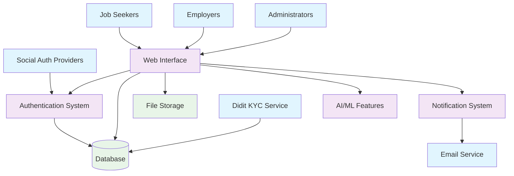

## 1. User Registration and Authentication Flow

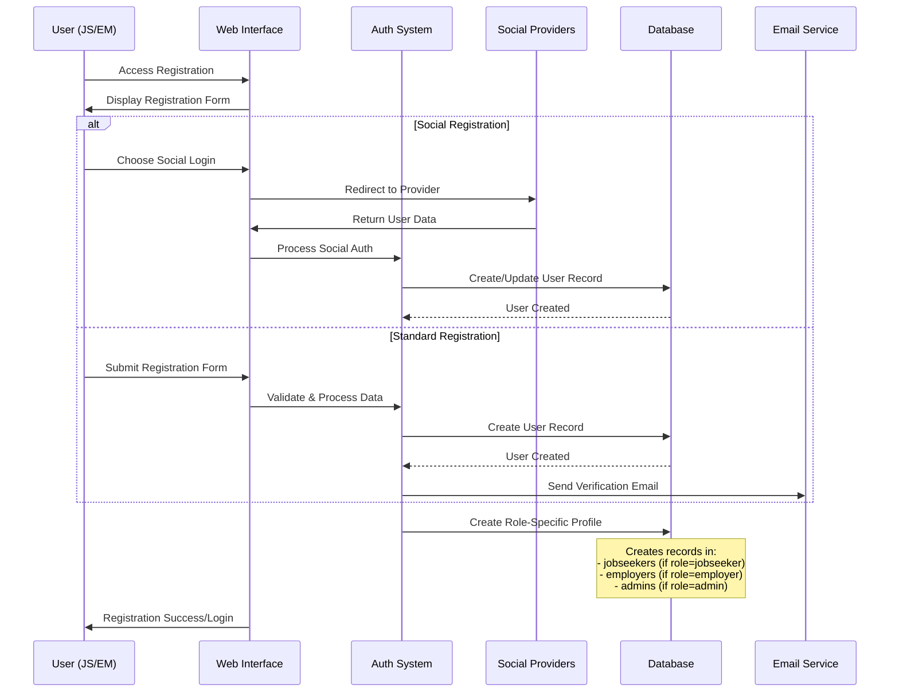

## 2. KYC Verification Process Flow

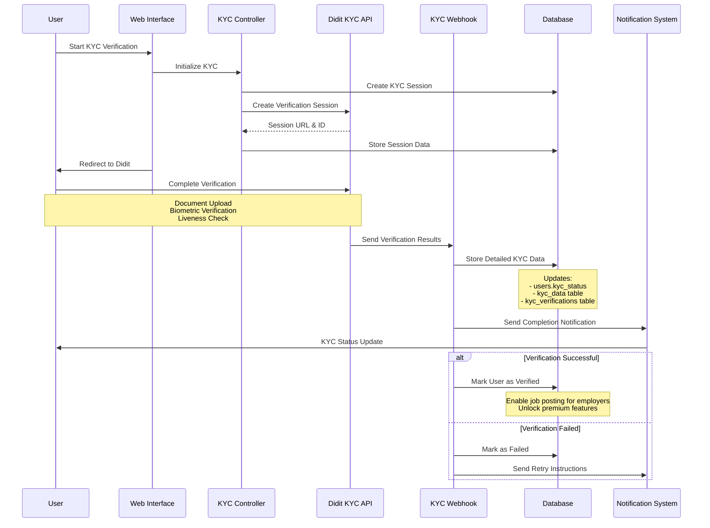

## 3. Job Management Flow (Employer Perspective)

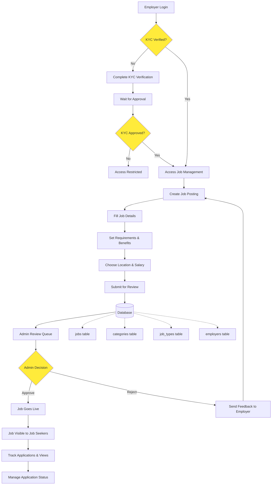

## 4. Job Application Process Flow

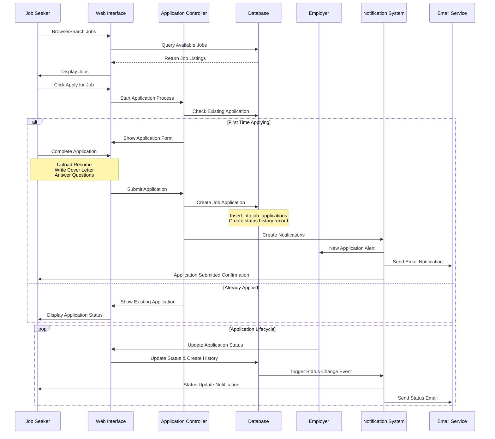

## 5. Job Search and Recommendation Flow

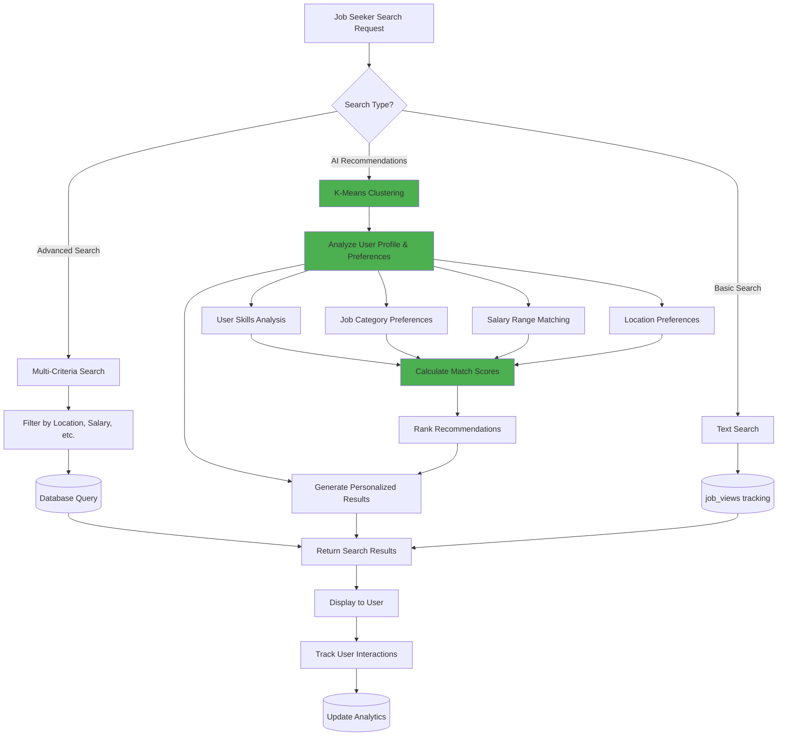

## 6. Admin Management Flow

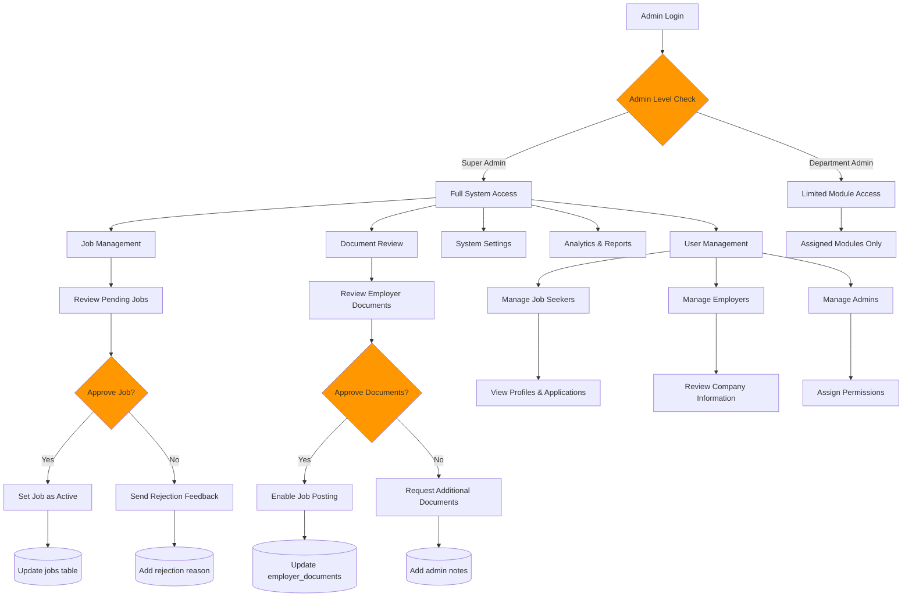

## 7. Notification System Flow

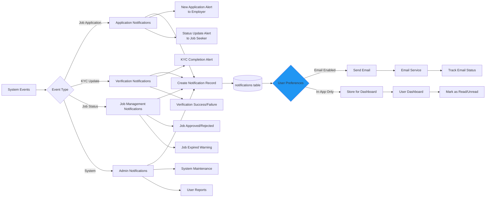

## 8. File and Document Management Flow

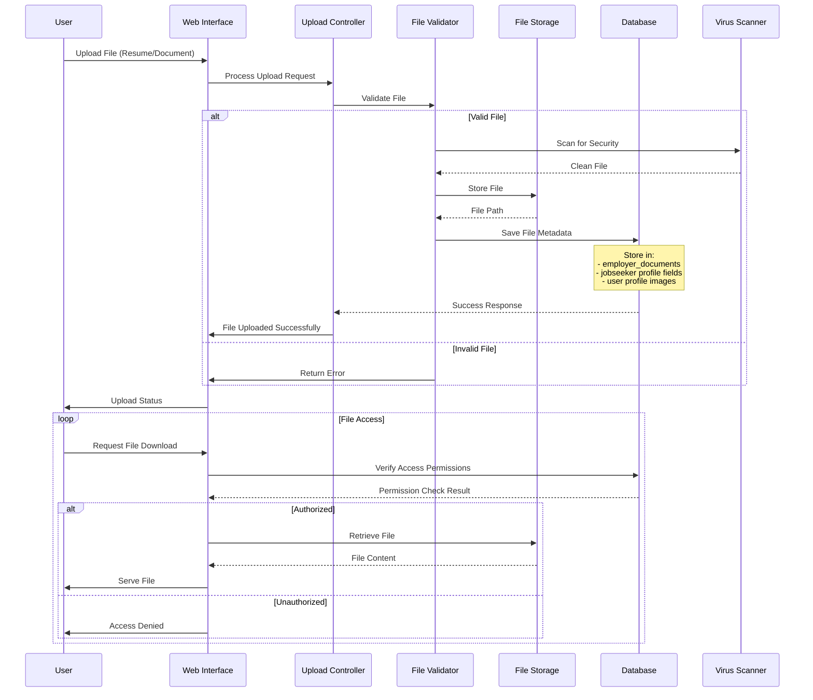

## 9. Database Entity Relationships and Data Flow

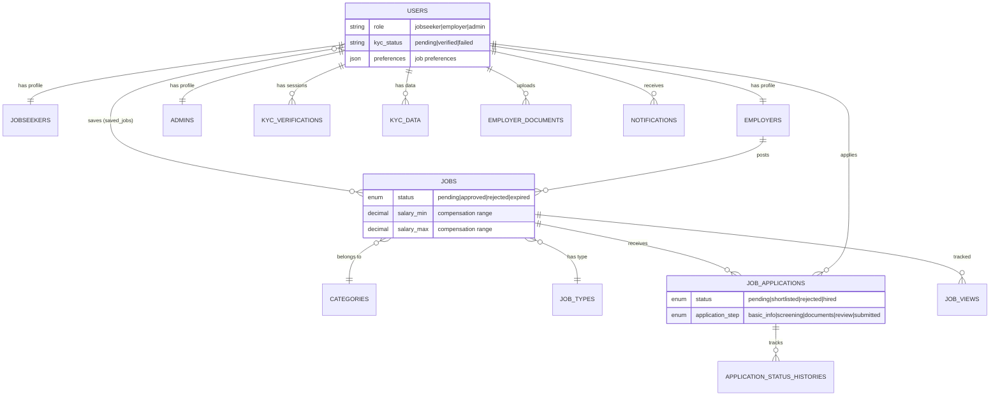

## 10. Analytics and Reporting Data Flow

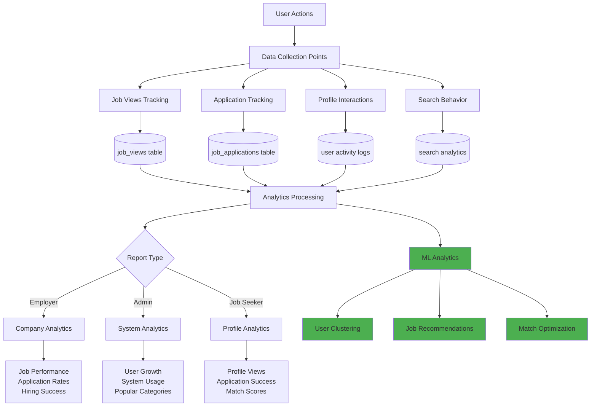

## Key Data Flow Characteristics

### 1. **Role-Based Data Separation**
- **Users Table**: Central authentication hub
- **Jobseekers Table**: Detailed job seeker profiles and preferences
- **Employers Table**: Company information and business details
- **Admins Table**: Administrative permissions and activities

### 2. **Multi-Layer Verification**
- **Email Verification**: Standard account verification
- **KYC Verification**: Identity verification via Didit API
- **Document Verification**: Business document review for employers

### 3. **Event-Driven Notifications**
- Real-time notifications for applications, status changes, and system events
- Multiple delivery channels (in-app, email)
- User preference-based notification filtering

### 4. **Advanced Job Matching**
- K-means clustering for personalized recommendations
- Skills-based matching algorithms
- Location and salary preference filtering
- Experience level compatibility

### 5. **Comprehensive Audit Trail**
- Application status history tracking
- Admin action logging
- KYC verification audit trail
- User activity analytics

## Security Considerations in Data Flow

1. **Authentication Security**
   - Password hashing using Laravel's built-in bcrypt
   - Social OAuth integration for secure third-party login
   - Session management with CSRF protection

2. **File Upload Security**
   - File type validation and size restrictions
   - Virus scanning for uploaded documents
   - Secure file storage with access controls

3. **API Security**
   - KYC webhook signature verification
   - Rate limiting on public endpoints
   - Input validation and sanitization

4. **Data Privacy**
   - GDPR-compliant data handling
   - User consent management
   - Secure deletion of sensitive data

This comprehensive data flow diagram illustrates how your Job Portal system efficiently manages data across different user roles, processes, and integrations while maintaining security and user experience standards.
