# Job Portal System - Entity Relationship Diagram (ERD)

## Overview
This ERD represents the database structure of a comprehensive job portal system with user management, job postings, applications, KYC verification, and document management.

## Core Entities and Relationships

```mermaid
erDiagram
    %% User Management
    users ||--|| employers : "has employer profile"
    users ||--|| jobseekers : "has jobseeker profile"
    users ||--|| admins : "has admin profile"
    users ||--o{ kyc_verifications : "has many"
    users ||--o{ kyc_data : "has many"
    users ||--o{ employer_documents : "uploads"
    users ||--o{ notifications : "receives"
    
    %% Job-related entities
    users ||--o{ jobs : "employer posts"
    jobs }o--|| categories : "belongs to"
    jobs }o--|| job_types : "has type"
    jobs ||--o{ job_applications : "receives applications"
    jobs ||--o{ job_views : "tracked views"
    jobs }o--o{ users : "saved by users (saved_jobs)"
    
    %% Application workflow
    job_applications ||--o{ application_status_histories : "status tracking"
    job_applications }o--|| users : "applied by user"
    job_applications }o--|| jobs : "application for job"
    
    %% Job Alerts
    users ||--o{ job_alerts : "creates alerts"
    job_alerts }o--o{ categories : "alert categories (job_alert_categories)"
    job_alerts }o--o{ job_types : "alert job types (job_alert_job_types)"
    
    %% Authentication & Authorization
    users }o--o{ roles : "user roles (user_roles)"
    roles }o--o{ permissions : "role permissions (role_permissions)"
    
    %% Users table
    users {
        bigint id PK
        string name
        string email UK
        timestamp email_verified_at
        string password
        string mobile
        string designation
        string image
        enum role "superadmin, admin, employer, jobseeker"
        json skills
        text education
        int experience_years
        text bio
        text address
        boolean is_verified
        string verification_document
        json preferred_job_types
        json preferred_categories
        string preferred_location
        string preferred_salary_range
        string phone
        boolean is_active
        json notification_preferences
        json privacy_settings
        string kyc_status
        string kyc_session_id
        timestamp kyc_completed_at
        timestamp kyc_verified_at
        json kyc_data
        json preferred_categories_job_prefs
        string experience_level
        decimal salary_expectation_min
        decimal salary_expectation_max
        string google_id
        string google_token
        string google_refresh_token
        string profile_image
        string remember_token
        timestamp created_at
        timestamp updated_at
        timestamp deleted_at
    }
    
    %% Employer Profiles
    employers {
        bigint id PK
        bigint user_id FK
        string company_name
        string company_slug UK
        text company_description
        string company_website
        string company_logo
        string company_size
        string industry
        year founded_year
        string contact_person_name
        string contact_person_designation
        string business_email
        string business_phone
        text business_address
        string city
        string state
        string country
        string postal_code
        decimal latitude
        decimal longitude
        string business_registration_number
        string tax_identification_number
        json business_documents
        string linkedin_url
        string facebook_url
        string twitter_url
        string instagram_url
        string subscription_plan
        timestamp subscription_starts_at
        timestamp subscription_ends_at
        int job_posts_limit
        int job_posts_used
        enum status "active, inactive, suspended, pending"
        boolean is_verified
        boolean is_featured
        timestamp verified_at
        json notification_preferences
        json settings
        int total_jobs_posted
        int total_applications_received
        int total_hires
        decimal average_rating
        timestamp created_at
        timestamp updated_at
    }
    
    %% Jobseeker Profiles
    jobseekers {
        bigint id PK
        bigint user_id FK
        string first_name
        string last_name
        string middle_name
        date date_of_birth
        string gender
        string nationality
        string marital_status
        string phone
        string alternate_phone
        string linkedin_url
        string portfolio_url
        string github_url
        text current_address
        text permanent_address
        string city
        string state
        string country
        string postal_code
        string current_job_title
        string current_company
        text professional_summary
        int total_experience_years
        int total_experience_months
        json skills
        json soft_skills
        json languages
        json certifications
        json education
        json courses
        json work_experience
        json projects
        json preferred_job_types
        json preferred_categories
        json preferred_locations
        boolean open_to_remote
        boolean open_to_relocation
        decimal expected_salary_min
        decimal expected_salary_max
        string salary_currency
        enum salary_period "hourly, daily, weekly, monthly, yearly"
        enum availability "immediate, 1_week, 2_weeks, 1_month, 2_months, 3_months"
        date available_from
        boolean currently_employed
        int notice_period_days
        string resume_file
        string cover_letter_file
        string profile_photo
        json portfolio_files
        json notification_preferences
        json privacy_settings
        boolean profile_visibility
        boolean allow_recruiter_contact
        json job_alert_preferences
        string facebook_url
        string twitter_url
        string instagram_url
        enum profile_status "incomplete, complete, verified, suspended"
        boolean is_featured
        boolean is_premium
        timestamp premium_expires_at
        decimal profile_completion_percentage
        int profile_views
        int total_applications
        int interviews_attended
        int jobs_offered
        decimal average_rating
        text search_keywords
        decimal search_score
        timestamp created_at
        timestamp updated_at
    }
    
    %% Admin Profiles
    admins {
        bigint id PK
        bigint user_id FK
        string first_name
        string last_name
        string department
        string position
        json permissions
        boolean is_super_admin
        timestamp last_login
        json preferences
        timestamp created_at
        timestamp updated_at
    }
    
    %% Jobs
    jobs {
        bigint id PK
        bigint employer_id FK
        bigint job_type_id FK
        bigint category_id FK
        string title
        text description
        text requirements
        text benefits
        string salary_range
        string location
        string location_name
        string location_address
        string address
        decimal latitude
        decimal longitude
        string barangay
        string city
        string province
        string experience
        int vacancy
        timestamp deadline
        enum status "pending, approved, rejected, expired, closed"
        string rejection_reason
        timestamp approved_at
        timestamp rejected_at
        boolean is_featured
        boolean is_remote
        string experience_level
        string education_level
        decimal salary_min
        decimal salary_max
        boolean status_active
        boolean featured
        int views
        string source
        json meta_data
        timestamp created_at
        timestamp updated_at
        timestamp deleted_at
    }
    
    %% Categories
    categories {
        bigint id PK
        string name
        string slug UK
        boolean status
        string icon
        timestamp created_at
        timestamp updated_at
        timestamp deleted_at
    }
    
    %% Job Types
    job_types {
        bigint id PK
        string name
        string slug UK
        boolean status
        timestamp created_at
        timestamp updated_at
        timestamp deleted_at
    }
    
    %% Job Applications
    job_applications {
        bigint id PK
        bigint job_id FK
        bigint user_id FK
        enum status "pending, approved, rejected"
        boolean shortlisted
        text cover_letter
        string resume
        text notes
        timestamp applied_date
        timestamp created_at
        timestamp updated_at
        timestamp deleted_at
    }
    
    %% Application Status History
    application_status_histories {
        bigint id PK
        bigint job_application_id FK
        string status
        text notes
        timestamp created_at
        timestamp updated_at
    }
    
    %% Job Views
    job_views {
        bigint id PK
        bigint job_id FK
        string ip_address
        string user_agent
        string device_type
        string referrer
        timestamp created_at
        timestamp updated_at
    }
    
    %% Saved Jobs (Pivot Table)
    saved_jobs {
        bigint id PK
        bigint job_id FK
        bigint user_id FK
        timestamp created_at
        timestamp updated_at
    }
    
    %% Job Alerts
    job_alerts {
        bigint id PK
        bigint user_id FK
        string location
        decimal salary_range
        enum frequency "daily, weekly, instant"
        boolean email_notifications
        timestamp created_at
        timestamp updated_at
    }
    
    %% Job Alert Categories (Pivot)
    job_alert_categories {
        bigint id PK
        bigint job_alert_id FK
        bigint category_id FK
        timestamp created_at
        timestamp updated_at
    }
    
    %% Job Alert Job Types (Pivot)
    job_alert_job_types {
        bigint id PK
        bigint job_alert_id FK
        bigint job_type_id FK
        timestamp created_at
        timestamp updated_at
    }
    
    %% Notifications
    notifications {
        bigint id PK
        bigint user_id FK
        string title
        text message
        string type
        json data
        string action_url
        timestamp read_at
        timestamp created_at
        timestamp updated_at
    }
    
    %% KYC Verifications
    kyc_verifications {
        bigint id PK
        bigint user_id FK
        string session_id UK
        string status
        string document_type
        string document_number
        string firstname
        string lastname
        date date_of_birth
        string gender
        text address
        string nationality
        json raw_data
        json verification_data
        timestamp completed_at
        timestamp verified_at
        timestamp created_at
        timestamp updated_at
    }
    
    %% KYC Data
    kyc_data {
        bigint id PK
        bigint user_id FK
        string session_id UK
        string status
        string didit_status
        string first_name
        string last_name
        string full_name
        date date_of_birth
        string gender
        string nationality
        string place_of_birth
        string marital_status
        string document_type
        string document_number
        date document_issue_date
        date document_expiration_date
        string issuing_state
        string issuing_state_name
        text address
        text formatted_address
        string city
        string region
        string country
        string postal_code
        decimal latitude
        decimal longitude
        decimal face_match_score
        string face_match_status
        decimal liveness_score
        string liveness_status
        string id_verification_status
        string ip_analysis_status
        decimal age_estimation
        string ip_address
        string ip_country
        string ip_city
        boolean is_vpn_or_tor
        string device_brand
        string device_model
        string browser_family
        string os_family
        text front_image_url
        text back_image_url
        text portrait_image_url
        text liveness_video_url
        json raw_payload
        json warnings
        string verification_method
        timestamp didit_created_at
        timestamp verified_at
        timestamp created_at
        timestamp updated_at
    }
    
    %% Employer Documents
    employer_documents {
        bigint id PK
        bigint user_id FK
        string document_type
        string document_name
        string file_path
        string file_name
        string file_size
        string mime_type
        enum status "pending, approved, rejected"
        text admin_notes
        timestamp submitted_at
        timestamp reviewed_at
        bigint reviewed_by FK
        timestamp created_at
        timestamp updated_at
    }
    
    %% Roles
    roles {
        bigint id PK
        string name
        string description
        timestamp created_at
        timestamp updated_at
        timestamp deleted_at
    }
    
    %% Permissions
    permissions {
        bigint id PK
        string name
        string description
        string group
        timestamp created_at
        timestamp updated_at
        timestamp deleted_at
    }
    
    %% Role Permissions (Pivot)
    role_permissions {
        bigint id PK
        bigint role_id FK
        bigint permission_id FK
        timestamp created_at
        timestamp updated_at
    }
    
    %% User Roles (Pivot)
    user_roles {
        bigint id PK
        bigint user_id FK
        bigint role_id FK
        timestamp created_at
        timestamp updated_at
    }
    
    %% Password Resets
    password_resets {
        string email
        string token
        timestamp created_at
    }
```

## Key Relationships Explained

### 1. User Management
- **users** is the central table that connects to all user types
- **employers**, **jobseekers**, and **admins** are profile extensions of users
- Each user has a role (superadmin, admin, employer, jobseeker)

### 2. Job Management
- **jobs** are created by employer users
- Jobs belong to **categories** and **job_types**
- Jobs can be saved by users (many-to-many via **saved_jobs**)
- Job views are tracked in **job_views**

### 3. Application Process
- **job_applications** link users to jobs they've applied for
- **application_status_histories** track status changes over time
- Applications can be shortlisted and have multiple status updates

### 4. KYC (Know Your Customer) System
- **kyc_verifications** store basic verification data
- **kyc_data** store detailed verification information from Didit service
- Both tables link to users for identity verification

### 5. Document Management
- **employer_documents** store business documents for employer verification
- Documents require admin approval before employers can post jobs

### 6. Notification System
- **notifications** store system notifications for users
- Job alerts (**job_alerts**) generate notifications for matching jobs

### 7. RBAC (Role-Based Access Control)
- **roles** and **permissions** define system access
- **role_permissions** and **user_roles** create many-to-many relationships

## Data Flow Examples

### Job Application Process
1. Employer creates a **job**
2. Job is categorized and needs admin approval
3. Jobseeker views job (tracked in **job_views**)
4. Jobseeker applies (creates **job_application**)
5. Status changes are tracked in **application_status_histories**
6. Notifications are sent to both parties

### KYC Verification Process
1. User starts KYC (creates **kyc_verification**)
2. External service (Didit) processes verification
3. Detailed data is stored in **kyc_data**
4. User's **kyc_status** is updated in **users** table
5. For employers, approved KYC enables job posting

### Document Verification (Employers)
1. Employer uploads documents (**employer_documents**)
2. Admin reviews and approves/rejects documents
3. Only employers with approved KYC AND documents can post jobs

## Indexes and Performance
- Primary keys (id) on all tables
- Foreign key indexes for relationships
- Composite indexes on frequently queried columns
- Status-based indexes for filtering
- Location-based indexes for job searches

## Security Considerations
- Soft deletes for most entities to maintain data integrity
- KYC data includes verification scores and fraud detection
- Document storage with file validation
- User activity tracking through job views and applications

This ERD represents a comprehensive job portal with robust user management, verification systems, and application workflows suitable for a professional recruitment platform.
